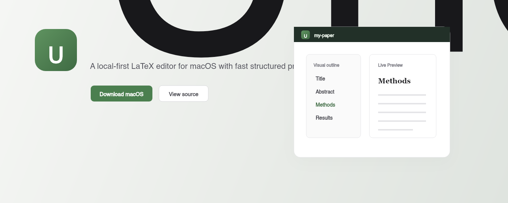
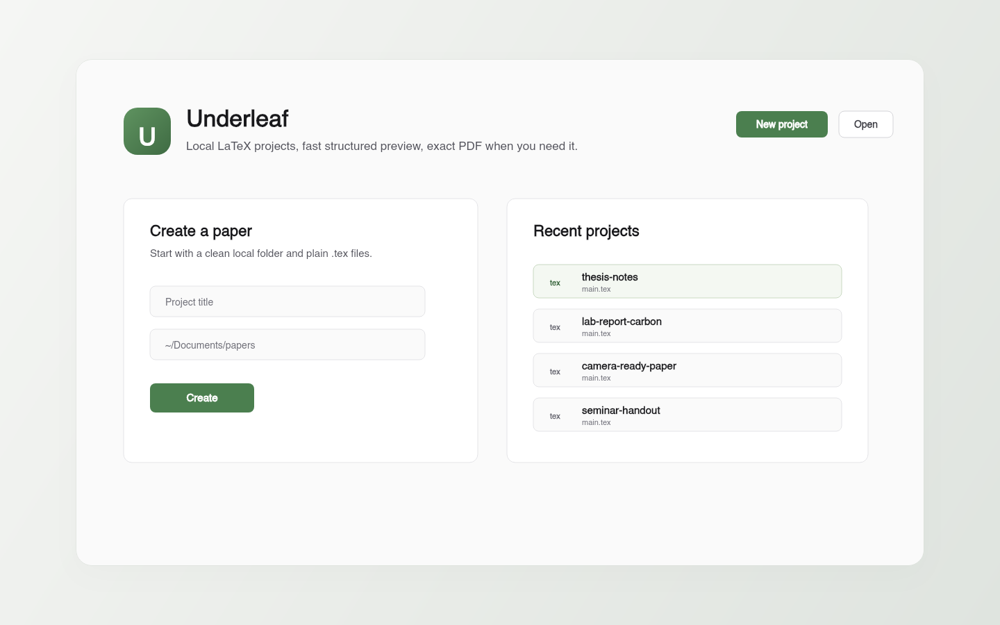
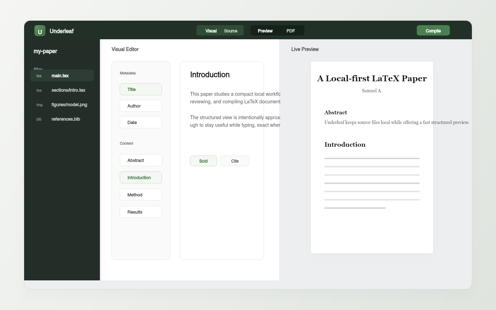

<p align="center">
  
</p>

<h1 align="center">Underleaf</h1>

<p align="center">
  A local-first LaTeX editor for macOS with a fast structured preview and exact PDF compile when you need it.
</p>

<p align="center">
  <a href="https://github.com/sammythedude/underleaf/releases/latest"><strong>Download for macOS</strong></a>
  ·
  <a href="#local-development">Run from source</a>
  ·
  <a href="#building-a-release">Build a release</a>
</p>



## Why Underleaf?

Underleaf is for people who like the plain-file workflow of LaTeX, but still want a calmer desktop writing space. Your project stays on disk as normal `.tex` files. The app gives you a structured live view while you write, and lets you switch to a compiled PDF for the exact output.

It is intentionally local-first: no account, no project upload, no cloud editor in the middle.

## Screenshots

| Dashboard | Workspace |
| --- | --- |
|  |  |

## Features

- Local `.tex` projects that stay in normal folders on your Mac
- Visual editor for document metadata, sections, paragraphs, lists, figures, tables, equations, code blocks, and theorem-like blocks
- Source mode powered by Monaco
- Fast structured preview for writing flow
- Exact PDF compile on demand
- PDF rendering inside the app
- Guided local TeX engine setup with Tectonic/TinyTeX support
- CLI launcher: `underleaf [project-folder]`

## Download

Grab the latest macOS build from the [GitHub Releases page](https://github.com/sammythedude/underleaf/releases/latest).

The current release ships as a macOS `.zip`. Unzip it, move `Underleaf.app` to Applications, then open it. Because the app is not notarized yet, macOS may ask you to confirm the first launch from System Settings or by right-clicking the app and choosing Open.

## Local Development

```bash
npm install
npm run dev
```

## Tests

```bash
npm test
```

## Build A Local App Bundle

```bash
npm run build:dir
```

That produces a macOS app directory in `release/mac-arm64/Underleaf.app`.

## Building A Release

```bash
npm run build
```

That produces a distributable macOS zip in `release/`.

To publish a new GitHub release from this repo:

```bash
git tag v0.1.0
git push origin v0.1.0
```

The release workflow builds the macOS zip and attaches it to the GitHub Release automatically.

## CLI Launch

Link the local CLI once:

```bash
npm run link-cli
```

Then launch the app from your shell:

```bash
underleaf
underleaf /absolute/path/to/project
```

## TeX Engine Notes

On first launch, Underleaf checks for local TeX engines including Tectonic, XeLaTeX, LuaLaTeX, PDFLaTeX, and common MacTeX/BasicTeX locations. If no suitable engine is available, the app can install a managed local compiler.

## Status

Underleaf is early software. It is useful for local writing workflows today, but expect sharp edges around complex LaTeX packages and advanced document structures.
